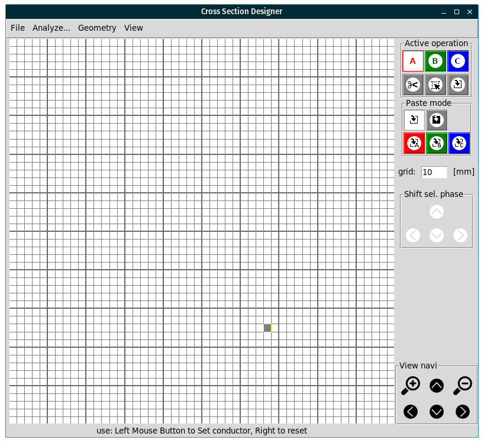
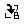
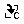

# Current-Density-Analyzer

# Introduction

## Short description

Current Density Analyzer or CSD.py is an application created for quick and easy analysis of the two dimensional cross section of current carrying conductor sets. 
It calculate the current density distribution in given conductors, generated ohmic power losses, equivalent single line circuit parameters and electrodynamic forces vectors for static case. There is as well simplified thermal solver available.

The whole idea is based on the assumption of quick-turnaround workflow:
- sketch the cross section shape
- define current parameters
- analyze and get results

## Application area and limitation

Tool is based on the AC circuit theory and therefore is capable to simulate only sinusoidal currents _(except the force solver - which assumes constant current)_. Basic underlying calculation methodology is a simple type of FEA method. It's approximating the given _(sketched)_ geometry by set of squares ant treat each of such piece _(element)_ as separate conductor in which the current density is uniform. Whit this assumption taken - the system wide ohm law based matrix equations are solved delivering the currents values in each element - and hence - the current density distribution.

With this principia the tool works well for a currents that are sinusoidal in shape of given frequency. The precision of the solution depends of the _elements_ size and can be increased by subdividing the sketched geometry into smaller _mesh_ approximation. But this comes with the cost of longer calculation times. 

## Used technology

This tool is written in python _([python](python.org))_ language and by so shall be OS agnostic. It has been developed under linux and tested in Windows.

The following dependencies and packages are uses (and required to work):
- python 3.xx
- matplotlib 
- numpy
- tkinter

It is required to have those packages available in the system to be able to use CSD.

# Working with the application

## Installation

1. Install python 3.xx language interpreter in your system (please refer to [python.org](python.org)). _I strongly suggest to install it with the pip python package manager for easier library installation._ 
2. Install numpy library (please refer to [numpy.org](https://numpy.org/)) _if the PIP is installed correctly it shall be possible to be done with the "pip install numpy" command_.
3. Install matplotlib plotting and visualization library (please refer to [matplotlib.org](https://matplotlib.org/)) _again it can be done with PIP_.
4. Get the thInter working. It should be there wit your pyton installation but that may depend on your OS _(please check online if a separate installation is needed)_.
5. Clone this repository to a folder on your machine, or download it as a ZIP file and extract to a folder on your machine.

## Running the app

In general the app is a python script (or rather a set of those) and can be run by:
- navigate to the folder where the repository was cloned or extracted
- execute command "python csd.py" _(in case of unix like system you may have more than one python interpreter installed and the command might be "python3 csd.py")_. If the installation of python was done by the installer the _.py_ files might my linked to the interpreter and hence it would be enough to double click on the csd.py file. 

## Application window

After successful installation the app will display the main window:

The main window can be divided into three general areas:
1. Top Menu Bar
2. Main Working Canvas
3. Right Action Panel

**The Top Menu Bar (1)** serve the typical function. 
- **File** menu allows for:
  -  geometry sketch load, 
  -  save, 
  -  reset canvas to empty.
- **Analyze...** menu can run:
  - Power Losses Pro Solver
  - Electrodynamic Forces Solver
  - Impedance Model Solver
- **Geometry** menu allows for:
  - Increase mesh density (subdivide)
  - Decrease mesh density (simplify)
- **View** menu:
  - Display CAD like sketch representation with dimensions.

**The Main Working Canvas (2)** is the checkered area where a conductors geometry cross section can be sketched by setting particular squares set for electrical phase A,B or C of the system. It's done by **Left Mouse Click** - if proper **Active operation** is set in the Right Action Panel (3). The **LMC** always realize the selected **Active operation** at the current mouse cursor location which is marked by _gray shadow box_ that's follow mouse move.

In the Canvas area - default behavior of **Right Mouse Click** is set to clear the _element_ under the cursor.

**Right Action Panel (3)** contains five main panels:
- **Active operation** This panel define the current operation in the Canvas Area. It can be (in order):

  - Painting the phase A elements { width=25px } 
  
  - Painting the phase B elements {width=25px} 
  
  - Painting the phase B elements {width=25px}

  - Clearing the selected element {width=25px}

  - Selecting & copying to clipboard rectangular area of sketch (by click LMB + drag) {width=25px}. The operation is automatically switched to Paste after copying to clipboard.

  - Paste the data from clipboard to current location (left top corner) by apply selected **Paste mode** {width=25px}

- **Paste mode** define the behavior during paste operation:

  - Clean paste in place {width=25px} put only non empty elements in the current location (clipboard empty cells don't erase destination area).

  - Full paste in place {width=25px} put all clipboard elements in the current location (clipboard empty cells erase destination area).

  - Paste elements as phase A {width=25px}, B {width=25px} or C {width=25px} put all non empty elements in the current location turning them into elements of phase A,B or C respectively.

- **grid size** allows to define the real world size of single grid _(mesh)_ element. This can be modified at any time just by entering any number and "de click" the text field area.

- **Shift selected phase** those directional controls allows to shift all elements of active phase (active by means of {width=25px}{width=25px} {width=25px} buttons) in canvas by a 1 _element_ in given direction. Tis functionality is reminiscence of previous version and might be removed with future updates. 

- **View navigation** allows to zoom in and out in the canvas view and move view around if in zoommed mode. 

## App in simple use

Please check the video that shows the basics of the CSD operations. 
[CSD 2020 Introduction Video](https://youtu.be/Y_QvcZTISQs)
<iframe width="560" height="315" src="https://www.youtube-nocookie.com/embed/Y_QvcZTISQs?controls=0" frameborder="0" allow="accelerometer; autoplay; clipboard-write; encrypted-media; gyroscope; picture-in-picture" allowfullscreen></iframe>

More in depth text description will be added later on.

 
