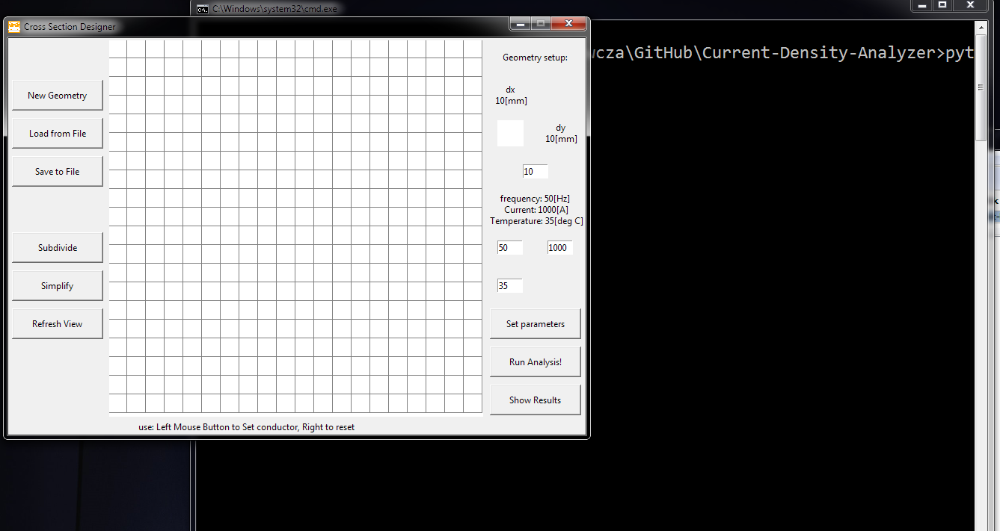

# Current-Density-Analyzer
This is repository for tool that analyze the current density distribution in conductors.

So – long story short – after putting together  a round of 600 lines of code (in python off course) and learning some basic usage of the tkinter GUI building framework I can now for the first time release to you beta version of the CSD app.
This app is a python based mirror of the calculator of the Current Density Distribution that was available on my webpage (actually still is http://tomasztomanek.pl/pub/webapp/IcwThermal). 

Please give it a try!

Installation:
1.	If you already have python installed you can jump to point 2
a.	Install on your system the anaconda package from: https://www.continuum.io/downloads
b.	This should be all you need to do.
2.	Download the CSD app script from GitHub: 
a.	https://github.com/tymancjo/Current-Density-Analyzer/blob/master/Relese_for_beta/CSDapp.zip
b.	Unzip the content to a directory of your choice.

You should be good to go!
If anything is not working – let me know!

Run the app:
1.	Navigate to the directory where you unzipped the app files:

2.	Double click on the “Cross Section Design Analyzer.cmd” if you are in windows world
3.  Or run the csd.py script from your python interperer 
 
3.	You should have app and terminal window pop-up

4.	Now you can start using the app. All your actions are done in the main app window. Terminal will display some data that reflect particular calculations steps. But this is nothing you need to worry about.

Using the app:
1.	Let’s use the app for simple case of one copper bar
2.	Main window description:

 
3.	Defined geometry of copperbar 100x10 on initial grid 10x10mm size: 

4.	Now we can click “Run Analysis!” and we will get the following results:
 

5.	The above results are not very spectacular due to low number of samples per bar. Let’s fix it by clicking “Subdivide” 2 or 3 times getting:

 
6.	And Run it again with results:

 
7.	From here we can go and try other cross sections and shapes.

